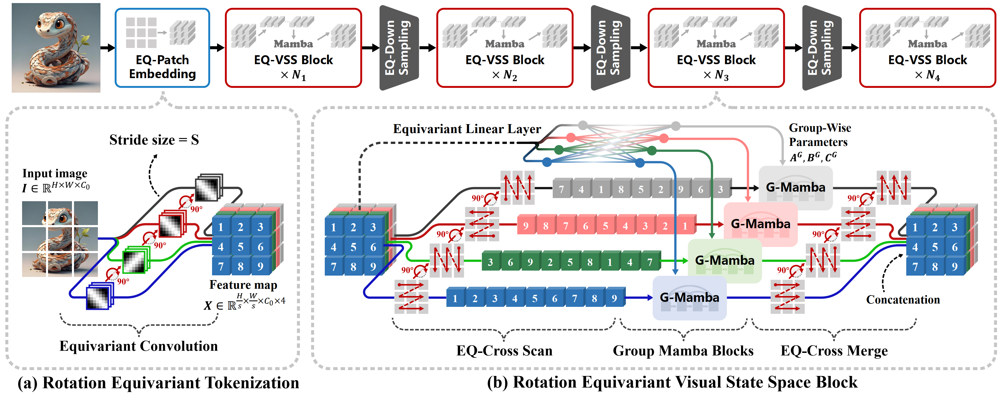
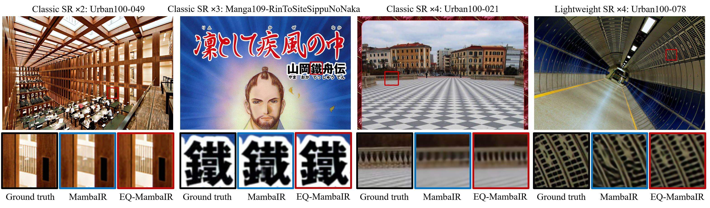

# Rotation Equivariant Mamba for Vision Tasks  

✨Official codes for **Rotation Equivariant Mamba for Vision Tasks (EQ-VMamba)**

**🤗 Don’t hesitate to give me a ⭐️, if you are interested in this project!**

[](https://arxiv.org/abs/2603.09138)


## 📌 Updates

* ***2026.03.10*** We have submitted the preprint of our paper to [Arxiv](https://arxiv.org/abs/2603.09138)!
* ***2025.03.21*** We have released the complete training code.


## 💡 Getting started

**The overall architecture of the proposed end-to-end rotation equivariant visual Mamba (EQ-VMamba).** **The framework mainly consists of: (a) an EQ-Patch Embedding module that tokenizes the input image into the group-structured feature maps, and (b) a stack of EQ-VSS blocks for hierarchical feature extraction. Each EQ-VSS block integrates an EQ-cross-scan operation for image-to-sequence flattening, group Mamba blocks for sequence modeling, and an EQ-cross-merge operation for sequence-to-image restoration.**





## 🧠 Abstract

Rotation equivariance constitutes one of the most general and crucial structural priors for visual data, yet it remains notably absent from current Mamba-based vision architectures. Despite the success of Mamba in natural language processing and its growing adoption in computer vision, existing visual Mamba models fail to account for rotational symmetry in their design. This omission renders them inherently sensitive to image rotations, thereby constraining their robustness and cross-task generalization. 

To address this limitation, we propose to incorporate rotation symmetry, a universal and fundamental geometric prior in images, into Mamba-based architectures. Specifically, we introduce **EQ-VMamba**, the first rotation equivariant visual Mamba architecture for vision tasks. The core components of EQ-VMamba include a carefully designed rotation equivariant cross-scan strategy and group Mamba blocks. Moreover, we provide a rigorous theoretical analysis of the intrinsic equivariance error, demonstrating that the proposed architecture enforces end-to-end rotation equivariance throughout the network.

Extensive experiments across multiple benchmarks - including high-level image classification task, mid-level semantic segmentation task, and low-level image super-resolution task - demonstrate that EQ-VMamba achieves superior or competitive performance compared to non-equivariant baselines, while requiring approximately 50% fewer parameters. These results indicate that embedding rotation equivariance not only effectively bolsters the robustness of visual Mamba models against rotation transformations, but also enhances overall performance with significantly improved parameter efficiency.


#### Super-resolution Visualization Results




## 🚀 Quick Start

#### 1. Requirements

```
conda create -n eqvmamba  python=3.10.14;
conda activate eqvmamba;

pip install torch==2.4.0 torchvision==0.19.0 torchaudio==2.4.0 --index-url https://download.pytorch.org/whl/cu124;

pip install timm==0.6.12 tqdm==4.65.2 opencv-python==4.11.0.86 matplotlib==3.10.3 einops==0.8.1 addict==2.4.0 yacs==0.1.8 fvcore==0.1.5.post20221221 ftfy==6.3.1 tensorboard==2.20.0;

pip install -U openmim; 
mim install mmengine; 
pip install mmcv==2.2.0 -f https://download.openmmlab.com/mmcv/dist/cu121/torch2.4/index.html; 
pip install "mmsegmentation>=1.0.0"; mim install mmdet;
```

Download [causal-conv1d](https://github.com/Dao-AILab/causal-conv1d/releases?utm_source=chatgpt.com) and [mamba_ssm](https://github.com/state-spaces/mamba/releases).

```
pip install ./causal_conv1d-1.4.0+cu122torch2.4cxx11abiFALSE-cp310-cp310-linux_x86_64.whl;

pip install ./mamba_ssm-2.2.2+cu122torch2.4cxx11abiFALSE-cp310-cp310-linux_x86_64.whl;


cd kernels/selective_scan && pip install .
# if failed, use:
python setup.py build_ext --inplace
```


#### 2. Training on image classification task

```
cd classification/

# EQ-VMamba-Tiny
python -m torch.distributed.launch --nnodes=1 --node_rank=0 --nproc_per_node=8 --master_addr="127.0.0.1"  --master_port=29501 main.py --cfg ./configs/eqvssm/eqvmambav2v_tiny_224.yaml --batch-size 128 --dataset imagenet100 --data-path <path-to-imagenet100> --output ./exp;


# EQ-VMamba-Small
python -m torch.distributed.launch --nnodes=1 --node_rank=0 --nproc_per_node=8 --master_addr="127.0.0.1" --master_port=29501 main.py --cfg ./configs/eqvssm/eqvmambav2v_small_224.yaml --batch-size 128 --dataset imagenet100 --data-path <path-to-imagenet100> --output ./exp ;
```


#### 3. Training on semantic segmentation task (based on Mmsegmentation)

```
cd segmentation/

# EQ-VMamba-Tiny
bash ./tools/dist_train.sh ./configs/eqvssm/upernet_eqvssm_4xb4-160k_ade20k_ImageNet100-512x512_tiny.py 8;
bash ./tools/dist_train.sh ./configs/eqvssm/upernet_eqvssm_4xb4-160k_voc12_ImageNet100-512x512_tiny.py 8;
bash ./tools/dist_train.sh ./configs/eqvssm/upernet_eqvssm_4xb4-160k_cityscapes_ImageNet100-1024x1024_tiny.py 8;
bash ./tools/dist_train.sh ./configs/eqvssm/upernet_eqvssm_4xb4-160k_cocostuff_ImageNet100-512x512_tiny.py 8;

CUDA_VISIBLE_DEVICES=0,1 bash ./tools/dist_train.sh ./configs/eqvssm/upernet_eqvssm_4xb4-15k_loveda-512x512_tiny.py 2;
CUDA_VISIBLE_DEVICES=0,1 bash ./tools/dist_train.sh ./configs/eqvssm/upernet_eqvssm_4xb4-15k_potsdam-512x512_tiny.py 2;
CUDA_VISIBLE_DEVICES=0,1 bash ./tools/dist_train.sh ./configs/eqvssm/upernet_eqvssm_4xb4-15k_vaihingen-512x512_tiny.py 2;


# EQ-VMamba-Small
bash ./tools/dist_train.sh ./configs/eqvssm/upernet_eqvssm_4xb4-160k_ade20k_ImageNet100-512x512_small.py 8;
bash ./tools/dist_train.sh ./configs/eqvssm/upernet_eqvssm_4xb4-160k_voc12_ImageNet100-512x512_small.py 8;
bash ./tools/dist_train.sh ./configs/eqvssm/upernet_eqvssm_4xb4-160k_cityscapes_ImageNet100-1024x1024_small.py 8;
bash ./tools/dist_train.sh ./configs/eqvssm/upernet_eqvssm_4xb4-160k_cocostuff_ImageNet100-512x512_small.py 8;

CUDA_VISIBLE_DEVICES=0,1,2,3 bash ./tools/dist_train.sh ./configs/eqvssm/upernet_eqvssm_4xb4-15k_loveda-512x512_small.py 4;
CUDA_VISIBLE_DEVICES=0,1,2,3 bash ./tools/dist_train.sh ./configs/eqvssm/upernet_eqvssm_4xb4-15k_potsdam-512x512_small.py 4;
CUDA_VISIBLE_DEVICES=0,1,2,3 bash ./tools/dist_train.sh ./configs/eqvssm/upernet_eqvssm_4xb4-15k_vaihingen-512x512_small.py 4;
```


#### 4. Training on image super-resolution task

```
cd superresolution/basicsr/

# classic EQ-MambaIR
python -m torch.distributed.launch --nproc_per_node=8 --master_port=1234 basicsr/train.py -opt options/train/eqmambair/train_EQMambaIR_SR_x2.yml --launcher pytorch;
python -m torch.distributed.launch --nproc_per_node=8 --master_port=1234 basicsr/train.py -opt options/train/eqmambair/train_EQMambaIR_SR_x3.yml --launcher pytorch;
python -m torch.distributed.launch --nproc_per_node=8 --master_port=1234 basicsr/train.py -opt options/train/eqmambair/train_EQMambaIR_SR_x4.yml --launcher pytorch;


# lightweight EQ-MambaIR
CUDA_VISIBLE_DEVICES=0,1 python -m torch.distributed.launch --nproc_per_node=2 --master_port=1234 basicsr/train.py -opt options/train/eqmambair/train_EQMambaIR_lightSR_x2.yml --launcher pytorch;
CUDA_VISIBLE_DEVICES=0,1 python -m torch.distributed.launch --nproc_per_node=2 --master_port=1234 basicsr/train.py -opt options/train/eqmambair/train_EQMambaIR_lightSR_x3.yml --launcher pytorch;
CUDA_VISIBLE_DEVICES=0,1 python -m torch.distributed.launch --nproc_per_node=2 --master_port=1234 basicsr/train.py -opt options/train/eqmambair/train_EQMambaIR_lightSR_x4.yml --launcher pytorch;
```


## 💌 Acknowledgement

* *This project is built using [**VMamba**](https://github.com/MzeroMiko/VMamba), [**F-conv**](https://github.com/XieQi2015/F-Conv), [**Equivariant-ASISR**](https://github.com/XieQi2015/Equivariant-ASISR) repositories. We express our heartfelt gratitude for the contributions of these open-source projects.*
* *We also want to express our gratitude for some articles introducing this project and derivative implementations based on this project.*


## 📄 License

This project is released under the Apache 2.0 license. Please see the [LICENSE](/LICENSE) file for more information.


## 🔗 Citation

If you use our codes in your research, please consider the following BibTeX entry and giving us a star:

```BibTeX
@article{zhao2026rotation,
  title={Rotation Equivariant Mamba for Vision Tasks},
  author={Zhao, Zhongchen and Xie, Qi and Huang, Keyu and Zhang, Lei and Meng, Deyu and Xu, Zongben},
  journal={arXiv preprint arXiv:2603.09138},
  year={2026}
}
```

